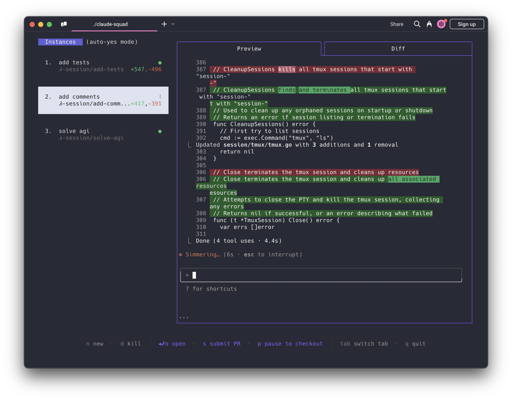

# Claude Squad

Claude Squad is terminal UI that manages multiple Claude Code (and other local agents including Aider) in separate workspaces, allowing you to work on different tasks simultaneously.



### Features
- Complete tasks in the background (including yolo / auto yes mode!)
- Manage instances and tasksin one terminal window
- Review changes before applying them, checkout change before pushing them
- Each task gets its own git workspace, so no conflicts

### Installation

The easiest way to install `claude-squad` is by running the following command:

```bash
curl -fsSL https://raw.githubusercontent.com/stmg-ai/claude-squad/main/install.sh | bash
```

This will install the `cs` binary to `~/.local/bin` and add it to your PATH. To install with a different name, use the `--name` flag:

```bash
curl -fsSL https://raw.githubusercontent.com/stmg-ai/claude-squad/main/install.sh | bash -s -- --name <name>
```

Alternatively, you can also install `claude-squad` by building from source or installing a pre-built binary (see project repository for details).

### Prerequisites

- [tmux](https://github.com/tmux/tmux/wiki/Installing)
- [git](https://git-scm.com/downloads)

### Usage

```
Usage:
  claude-squad [flags]
  claude-squad [command]

Available Commands:
  completion  Generate the autocompletion script for the specified shell
  debug       Print debug information like config paths
  help        Help about any command

Flags:
  -y, --autoyes          [experimental] If enabled, all instances will automatically accept prompts, even while you've exited the app.
  -h, --help             help for claude-squad
  -p, --program string   Program to run in new instances (e.g. 'aider --model sonnet --api-key anthropic=XXX')
      --reset            Reset all stored instances
```

Run the application with:

```bash
claude-squad
```

To use a specific AI assistant program:

```bash
claude-squad -p "aider --model ollama_chat/gemma3:1b"
```

#### Menu
The menu at the bottom of the screen shows available commands: 

##### Instance/Session Management
- `n` - Create a new session
- `N` - Create a new session with a prompt
- `D` - Kill (delete) the selected session
- `↑/j`, `↓/k` - Navigate between sessions

##### Actions
- `⏎/o` - Attach to the selected session to reprompt
- `ctrl-q` - Detach from session
- `s` - Commit and push branch to github
- `c` - Checkout. Commits changes and pauses the session
- `r` - Resume a paused session

##### Navigation
- `tab` - Switch between preview tab and diff tab
- `q` - Quit the application
- `shift-↓/↑` - scroll in diff view

#### Session States

- **Running** - Claude is actively working
- **Ready** - Claude is waiting for input
- **Paused** - Session is paused so you can checkout the branch to review changes. 

When you create a new session:
1. A new git branch is created for your session
2. A git worktree is created from that branch
3. A tmux session is launched with your chosen AI assistant tool (Claude Code by default)

When you pause a session:
1. Changes are committed to the branch
2. The tmux session is closed
3. The worktree is removed (but the branch is preserved)
4. Branch name is copied to clipboard for you to checkout

When you resume a session:
1. The worktree is recreated from the preserved branch (you cannot have the branch checked out to do this)
2. A new tmux session is launched with your AI assistant
3. You can continue from where you left off

### How It Works

1. **tmux** to create isolated terminal sessions for each agent
2. **git worktrees** to isolate codebases so each session works on its own branch
3. A simple TUI interface for easy navigation and management

### License

[AGPL-3.0](LICENSE.md)
